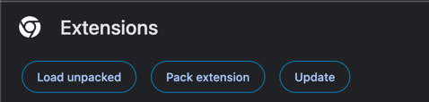
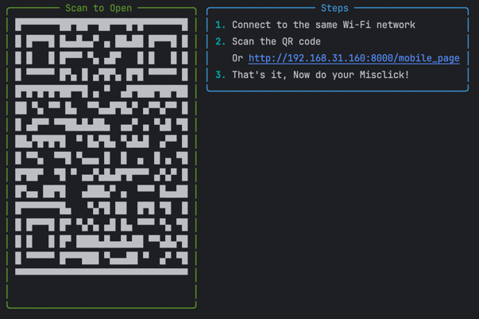
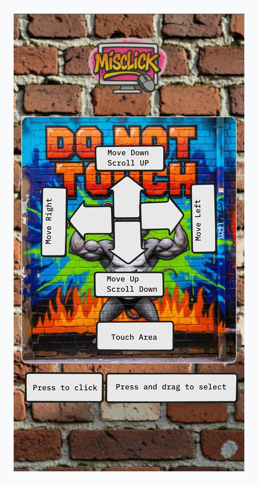
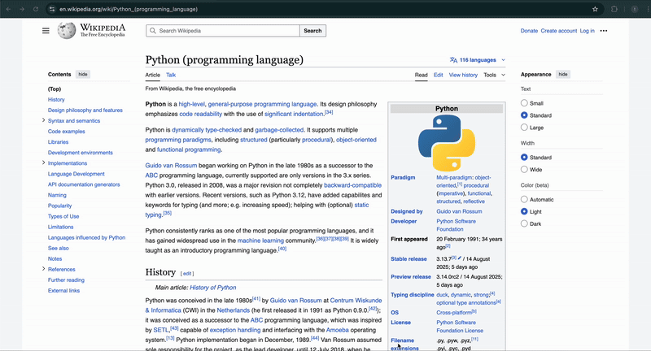
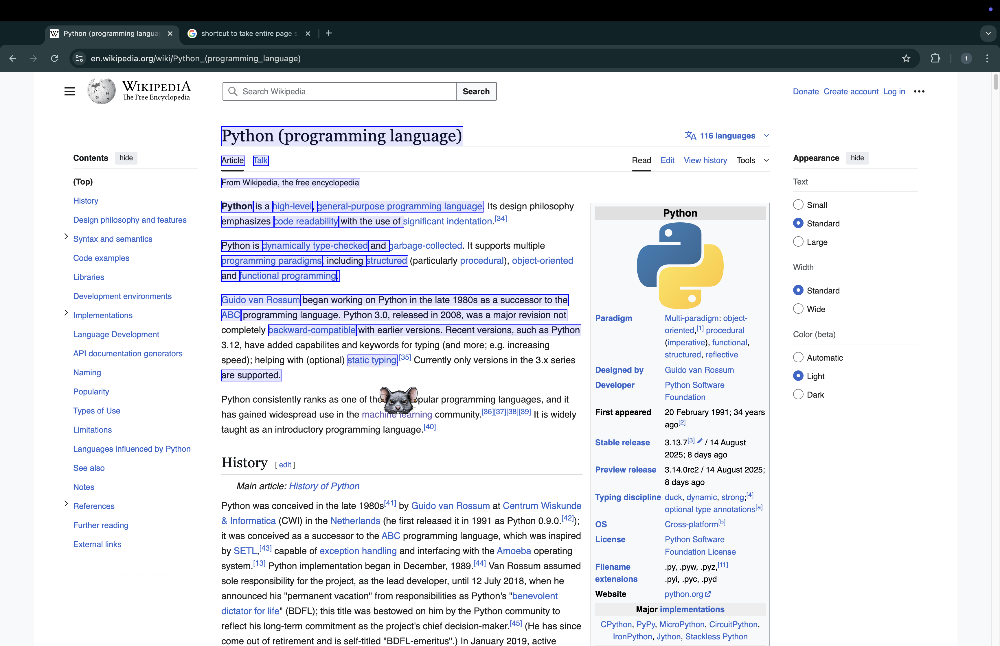
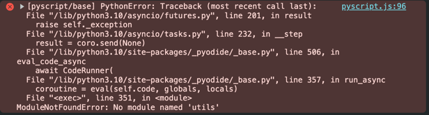
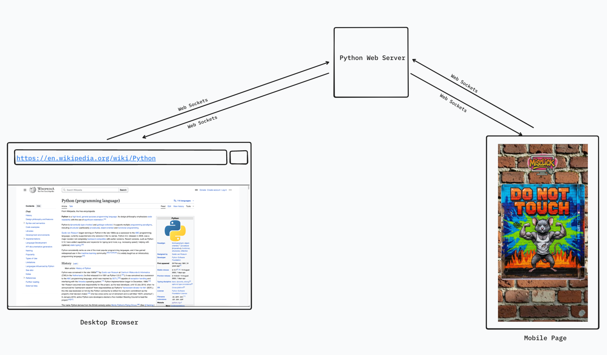

# Misclick 

<p align="center">
  
</p>
<p align="center">"<b>Wrong mouse, for a reason</b>"</p>
<p align="center">
  <!-- Stars -->
  

  <!-- Forks -->
  

  <!-- Issues -->
  

  <!-- License -->
  
</p>
Sure, you have a perfectly good keyboard and mouse… but why not run Python in your browser with a mobile?
What about doing a scroll, drag and maybe a click or that's all ?

That is Misclick - A way to control your mouse, **but in opposite way**

---

## 📑 Table of Contents

- [What can it do](#what-can-it-do)
- [Why is it the wrong tool](#why-is-it-the-wrong-tool-for-the-job)
- [How to install](#how-to-install)
- [How to use](#how-to-use)
- [How it is working](#how-it-is-working)
- [Limitations](#limitations)

---

## What can it do

- Oh, just casually pair your phone with your browser over WebSocket — because Bluetooth and USB are *too mainstream*.
- Control your browser’s mouse with your phone, but in reverse. Yes, swipe left to go right. Because logic is overrated.
    - What’s on the menu?
        - Swipe left, swipe right — like Tinder, but for your cursor.
        - Swipe up or swipe down.
        - Click links and sections — basically what your mouse already does, but now slower and more annoying.
        - Scroll up, scroll down — congratulations, you’ve invented scrolling.
- Feeling idle? Don’t worry, the mouse entertains itself with *modes*:
    - **Wander Mode** – your cursor takes itself on a joyride. You’re just a spectator.
    - **Rage Mode** – because why not double the speed and lose control even faster?
    - **Shadow Mode** – cursor goes invisible. Perfect for when you *really* want to rage-quit.
    - Sometimes you get all of them combined, so best of luck.
    - Bonus: it randomly clicks on stuff, so enjoy your surprise shopping carts and unexpected **easter eggs**.
    - If you get redirected to another page, don’t worry — the chaos restarts automatically.
- **Drag text from your browser and send it to your phone. Groundbreaking. Nobel-worthy.**
- Install it as a browser extension, and enjoy the privilege of also opening a webpage on your phone. Wow.
- Cross-platform. Yes, it works everywhere, so nobody is safe.
- Runs locally, no hosting, no leaks — except your sanity.
- No accounts, no personal info — because who would *willingly* sign up for this anyway?

---
## Why is it the wrong tool for the job

You already have a perfectly good **mouse**.  
So why on earth would you want to turn your **mobile into one**?

- You don’t *need* your phone as a mouse if you already own one.  
- It doesn’t just move the cursor… it moves it the **opposite way** you tell it to.  
- Scrolling? Clicks? Forget precision — this thing thrives on chaos.
- And to make sure you never get comfortable, we’ve added 3 **Chaotic Modes** that guarantee *you’re not in charge*.


---

> **In short:** It’s unnecessary, uncooperative, and completely backwards.  
> Which is exactly why it deserves to exist.

## How to install

### Prerequisites

- Python 3.12+
- A modern web browser (Chrome recommended)

### Steps

1. Clone the repository:
   ```bash
   git clone https://github.com/SOORAJTS2001/daring-daffodils
   cd daring-daffodils
2. Installing Extension
    1. Open [chrome://extensions/](chrome://extensions/) and enable **Developer mode** as shown below:

   
    2. Click Load unpacked button and select
       the [browser_extension](https://github.com/SOORAJTS2001/daring-daffodils/tree/main/browser_extension) folder
       inside
       the **cloned repo**
       
3. Starting up server — **Make sure your PC/Laptop and phone are connected via the same WiFi**

    1. Option 1: Using [Makefile](https://en.wikipedia.org/wiki/Make_(software))
        1. Just run the command:
            -  Linux/MacOS
               ```bash
               make
               ```  
            - Windows
                - By default, Windows does not include GNU Make. Install via [this](https://www.msys2.org/)
                ```bash
               make
               ```  
           inside the root directory, where the `Makefile` is located.
    2. Option 2: Manual setup
        1. Create your environment:
           ```bash
           python3 -m venv .env
           ```  
        2. Activate it:
           - Linux/MacOS
           ```bash
           source .env/bin/activate
           ```  
           - Windows
           ```bash
           .env\Scripts\Activate.ps1
           ```
        3. Install Poetry:
           ```bash
           pip install poetry
           ```  
        4. Install dependencies:
           ```bash
           poetry install
           ```  
        5. Start the server
           ```bash
           python3 app.py
           ```
    3. After the server starts, it will show you a QR
       code. [Open that with your phone](https://www.android.com/articles/how-do-you-scan-qr-codes-on-android/)
         <p align="center">
          
         </p>

## How to use

<table align="center">
  <tr>
    <td align="center">
      <br/>
      <b>Mobile page</b>
    </td>
    <td align="center">
      <br/>
      <b>Browser extension</b>
    </td>
  </tr>
  <tr>
    <td align="center">
      <br/>
      <b>Browser extension - Basic movement</b>
    </td>
    <td align="center">
      <br/>
      <b>Browser extension - Mode Activation</b>
    </td>
  </tr>
  <tr>
    <td align="center">
      <br/>
      <b>Browser extension - Selection</b>
    </td>
    <td align="center">
      <br/>
      <b>Text Received by phone</b>
    </td>
  </tr>
</table>
<p align="center">
  
</p>

**⚠️ If you see an error like above**
or the mouse is not showing up:  

- Hard refresh the page  
- Restart the server

## How it is working

### Architecture Diagram

<p align="center">
          
         </p>

### Tech used

- Pyscript/pyodide for rendering UI
- `fastapi` for serving static pages and as a websocket server
- `qrcode` library for generating url for mobile page
- `pyodide` wrapper js to setup runtime for python in browser extension

### Working

<b>The backend is bind to the port `8000`</b>

#### Mobile page

- Once server is up, the mobile page url is shown in the terminal
- On opening the mobile page, the websocket connection between the server and the frontend is established via pyscript
- Inside the `mobile_page.py` it calls the Javascript native API's using pyodide/pyscript and manipulates the DOM
- We have eventListeners in js, which is used for listen and trigger to user events like drag, scroll and click
- We are having a proxy between the js and python for object and function transfer as
  explained [here](https://jeff.glass/post/pyscript-why-create-proxy/)
- For every js `touchstart` event we would record it, until it ends with `touchend` and send the <b>change ratio</b>
  rather than coordinates via
  websocket to the browser

#### Browser extension - This is where magic happens

- By default, Chrome extensions cannot load remote code (JS, WASM, CSS) from CDNs because of Content Security Policy (
  CSP).
- Hence we had to package the runtime scripts for python inside the browser, which is
  this [runtime](https://github.com/SOORAJTS2001/daring-daffodils/tree/main/browser_extension/runtime)
- Instead of making the entire extension in python which is very very hard (due to support),we are just injecting our
  python files and
  it's dependency into every website
- Upon activating (by default it has access to all web pages) it connects to our python web socket server, and
  shows  which turns-out to be your
  new cursor!
- When a `delta` is received from the mobile page, it is rescaled to match the browser’s dimensions and projected onto the browser. This causes the cursor to move according to the user’s interaction.
- It would get the type of event's user has sent like scroll, drag, selection and corresponding actions are performed

##### Clicks

- if a click is fired from the user side, then a `MouseEvent` is fired on browser
##### Drag
- Tap for 300ms and scroll is considered as the Drag
##### Selection
- It could send user selected text to their connected phone
- Defines a rectangle using the given screen coordinates (x1, y1) and (x2, y2).
- Walks through all text nodes in the document body.
- For each text node, checks whether any part of its bounding client rect intersects with the defined rectangle.
- If overlapping text is found:
    - Collects and returns the text content (whitespace-trimmed).
    - Visually highlights the region by overlaying a semi-transparent blue box.
    - The highlight box automatically disappears after 2 seconds.
    -
**Although, all our core functionality and logic are in python**<br><br>
***You may have noticed that a significant part of our project is shown as JavaScript. This is because the Python runtime in the browser extension relies on JavaScript to bootstrap and interact with WebAssembly.  
It mainly involves two key files:***

- **`pyodide.asm.js`** – Emscripten-generated “glue code” that initializes the WebAssembly (`.wasm`) binary and connects it to the browser’s JavaScript environment.  
- **`pyscript.js`** – JavaScript glue for PyScript. It integrates Pyodide with HTML elements like `<py-script>` and `<py-repl>`, enabling inline Python execution inside web pages or extensions.  

***Since extensions cannot load executable code directly from the internet (for security reasons), we had to package these files locally instead of relying on CDNs.***<br>

## Limitations
Sometimes the extension could not be used inside sites and restricts script injection, it will throw an error
